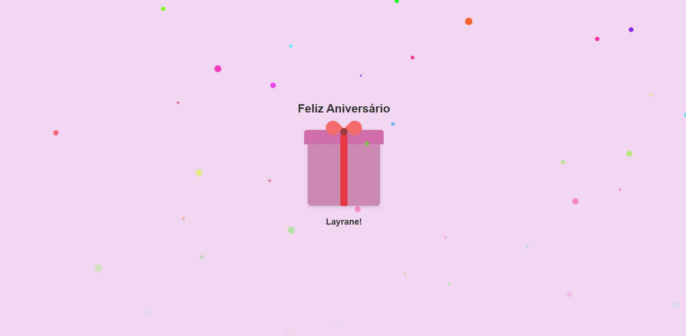

# 🎉 Site de Presente de Aniversário

Este projeto é um **site em HTML, JavaScript e CSS** criado como um presente de aniversário para uma amiga especial. 💖  

---

## 🌟 Prévia do Site
Aqui você pode ver uma prévia do site:  

  

## 📘 Sobre o Projeto
O site foi desenvolvido com **HTML, JavaScript e CSS** e tem como objetivo:

- Celebrar o aniversário de uma amiga querida;
- Ser visualmente agradável e divertido;
- Mostrar carinho e dedicação através da personalização do site.

---

## 🛠 Tecnologias Utilizadas
- HTML5
- CSS3
- JavaScript

---

## ✨ Autora

- 👩‍💻 Andressa de Pinho Barreto
- 📍 Alagoinhas – BA
- 🎓 Estudante de Sistemas de Informação e Técnico em Desenvolvimento de Sistemas (SENAI)
- 🔗 <a href="https://www.linkedin.com/in/andressa-barreto-5755112a6/" target="_blank" rel="noopener noreferrer">LinkedIn</a>
